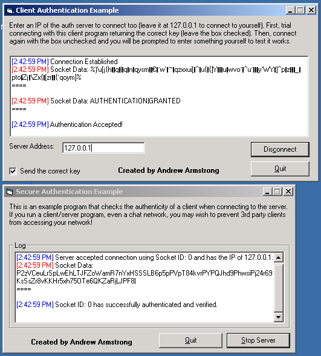



## Client/Server Authentication Example \(winsock\)

### Description

This example provides a good way of how to securly authenticate your client programs when connecting to your server. This prevents the use of 3rd party clients and unauthorized connections (such as telnet connections and 'reverse engeneering').

How it works: Once a client connects, the server transmits an encrypted string of 100 random characters (You may change this) and the client must respond with the decrypted version. The advantage here is, the server will send a DIFFERENT encryption string for each new connection! So if a 'hacker' finds out what code the client sent back, it will be of no use to him as when a new connection is made, a different 'key' is required to be sent back!

This program also supports the authentication of more than one connection at a time.

I would appreciate votes and comments, and would love to know if you use this method in any program you make.

Thanks! :D
 
### More Info
 
Note: This program uses VB6's SPLIT() function, you will need to find an alternative for use in VB5 and less. There is a VB5 version of the SPLIT() command posted on PSC somewhere!

             |
---                |---
**Submitted On**   |2002-07-06 15:07:10
**By**             |[Andrew A](https://github.com/Planet-Source-Code/PSCIndex/blob/master/ByAuthor/andrew-a.md)
**Level**          |Advanced
**User Rating**    |4.7 (14 globes from 3 users)
**Compatibility**  |VB 6\.0
**Category**       |[Internet/ HTML](https://github.com/Planet-Source-Code/PSCIndex/blob/master/ByCategory/internet-html__1-34.md)
**World**          |[Visual Basic](https://github.com/Planet-Source-Code/PSCIndex/blob/master/ByWorld/visual-basic.md)
**Archive File**   |[Client\_Ser102663762002\.zip](https://github.com/Planet-Source-Code/andrew-a-client-server-authentication-example-winsock__1-36626/archive/master.zip)

